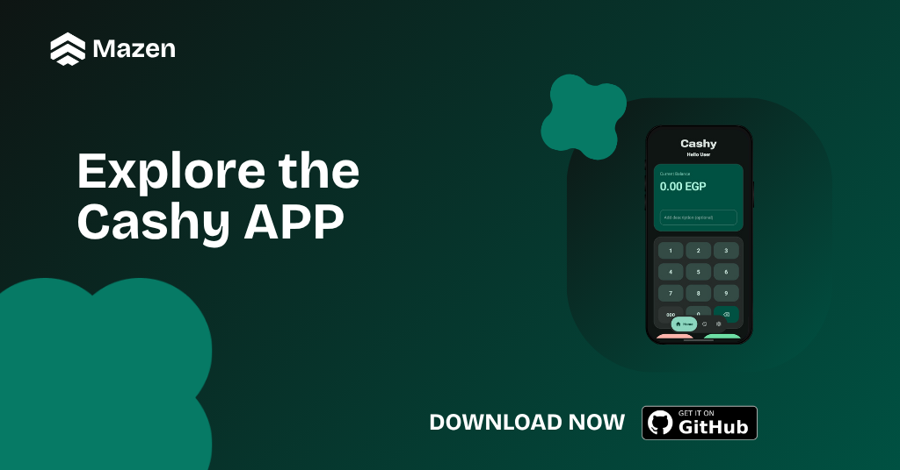
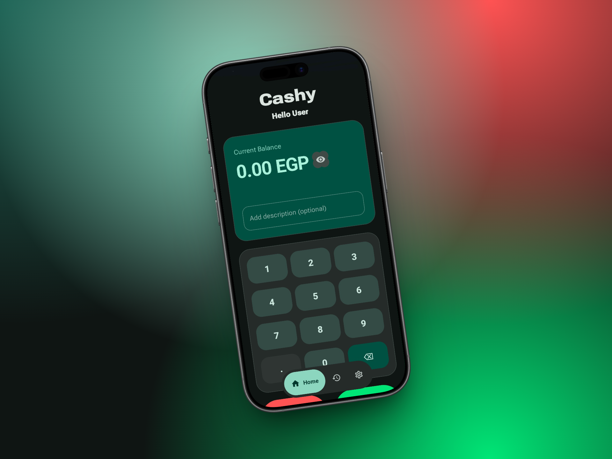
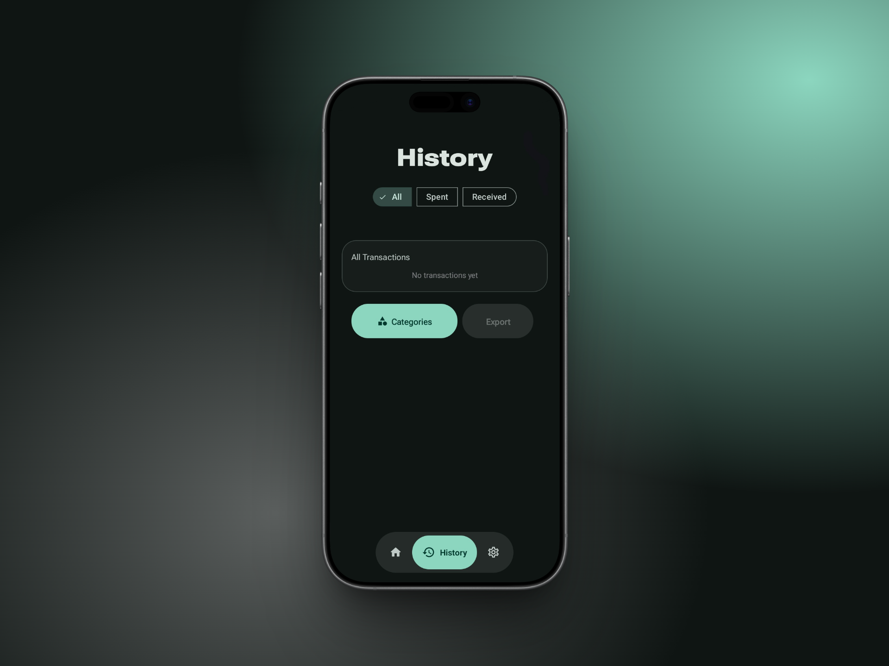
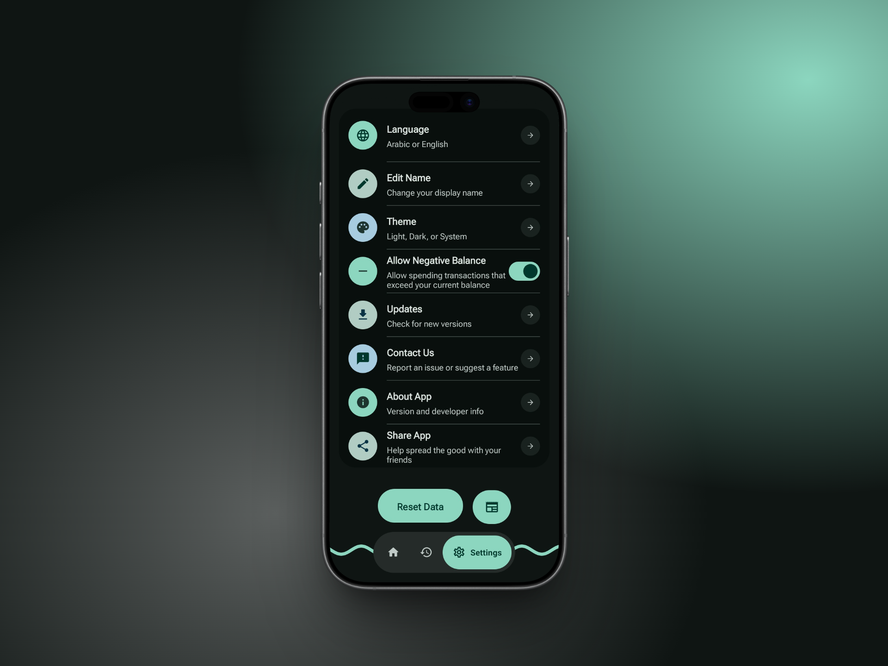

  

<h1 align="center">Cashy</h1>

<b>Your daily digital money tracker.. beautiful design with a smart and seamless user experience</b>

  

  &nbsp;&nbsp;
  &nbsp;&nbsp;
  &nbsp;&nbsp;
  

---

**Cashy** is a digital expense tracker built with the latest technologies to help you manage your financial life effortlessly. Utilizing the **Material 3 Expressive** design system, the app provides a calm, eye-pleasing interface combined with smooth spring animations that make tracking your money a truly delightful experience.

## ✨ Key Features (That You\'ll Love)

### 🎨 Premium UI/UX Experience
* **Material 3 Expressive Design:** A modern, cheerful interface built on Google's latest design guidelines for a top-tier visual experience.
* **Spring Animations:** Interactive feedback using custom interpolators for lively button presses and smooth transitions.

### 🧠 Smart & Interactive Data Tracking
* **Smart Security:** Enhanced protection with an advanced PIN lock screen and encrypted storage to keep your financial data strictly private.
* **Quick Input Numpad:** A custom-built numeric pad featuring responsive math operations, number formatting (e.g., 1,000), and dynamic decimal point adjustments.
* **Privacy Mode:** A dedicated mode to instantly hide your balance details when using the app in public spaces.
* **Dynamic Transaction Actions:** Swipe transaction rows smoothly to instantly edit or delete items with full Undo support.
## ⚙️ Robust Technical Architecture
* **Wide Device Compatibility:** The core codebase is optimized for maximum efficiency, supporting a broad range of devices with a minimum SDK of **Android 11** to ensure a flawless experience for everyone.
* **Lightweight & Battery-Friendly:** Background operations and resource management are crafted with precision, keeping the app lightning-fast while safeguarding your device's battery life.
* **Secure & Reliable Storage:** All financial records, encryption routines, and database queries are heavily tested and structured to prevent any data corruption or loss.

---

## 📸 Screenshots

| Home Screen | History Screen | Settings |
| :---: | :---: | :---: |
|  |  |  |

---
## 🛠 Tools & Libraries Used
* **Programming Language:** Kotlin.
* **Development Environment (IDE):** Android Studio.
* **Design System:** Material 3 Expressive.
* **Core Libraries:** `Room Database`, `Coroutines`, `SharedPreferences`, `androidx.appcompat`, `material`, `FileProvider`, and `AppCompatDelegate` (for dynamic language and theme management).
---
## 📥 Download App

You can download the latest version of the application directly as an APK file from the link below, and enjoy a smarter way to manage your expenses:

  

---

## ⭐ Support the Project

If you find **Cashy** helpful or love its design language, don't forget to drop a **Star** on the top right! Your support helps this project reach more users and keeps me motivated to add even more features.

---

  <picture>
    <source media="(prefers-color-scheme: dark)" srcset="https://i.postimg.cc/KzPKjBNn/footer-Dark.png">
    <source media="(prefers-color-scheme: light)" srcset="https://i.postimg.cc/C5wRq5P9/footer-Light.png">
    
  </picture>

